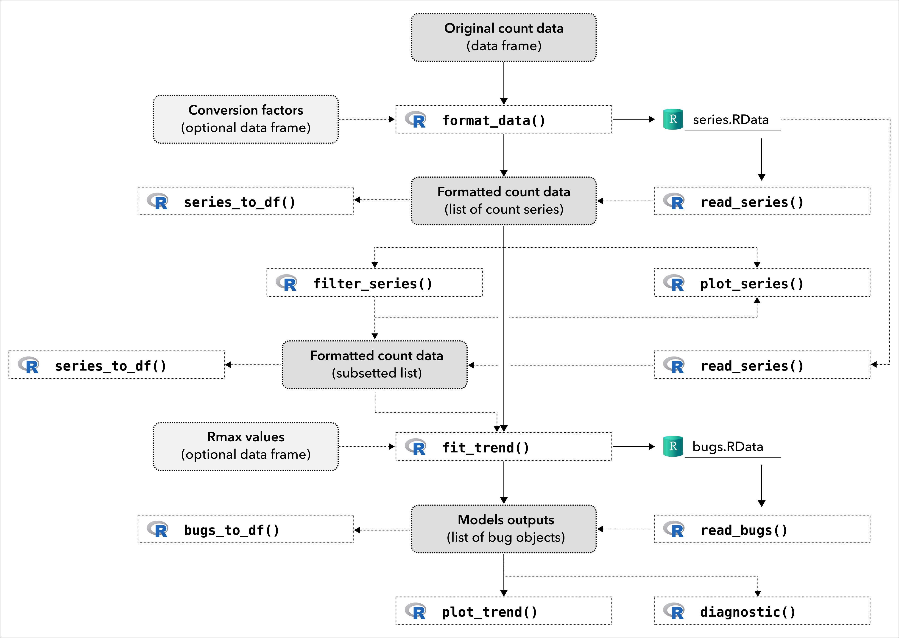

<!-- README.md is generated from README.Rmd. Please edit that file -->


```{r, include = FALSE}
knitr::opts_chunk$set(
  collapse  = TRUE,
  comment   = "#>",
  fig.path  = "man/figures/",
  out.width = "100%"
)
```


popbayes
=========================================================

<!-- badges: start -->
[](https://github.com/frbcesab/popbayes/actions/workflows/R-CMD-check.yaml)
[](https://github.com/frbcesab/popbayes/actions/workflows/pkgdown.yaml)
[](https://choosealicense.com/licenses/gpl-2.0/)
[](https://lifecycle.r-lib.org/articles/stages.html#stable)
[](https://www.repostatus.org/#active)
<!-- badges: end -->


The goal of the R package `popbayes` is to estimate population trends from counts series


## Installation

You can install the development version from [GitHub](https://github.com/) with:

```{r eval = FALSE}
## Install 'remotes' package (if not already installed) ----
if (!requireNamespace("remotes", quietly = TRUE)) {
  install.packages("remotes")
}

## Install dev version of 'popbayes' from GitHub ----
remotes::install_github("frbcesab/popbayes", build_vignettes = TRUE)
```

Then you can attach the package `popbayes`:

```{r eval = FALSE}
library("popbayes")
```


## Overview




## Get started

Please read the 
[Vignette](https://frbcesab.github.io/popbayes/articles/popbayes.html) 


## Citation

Please cite this package as: 

> Casajus N. & Pradel R. (2021) popbayes: Bayesian model to estimate populations trend. 
R package version 0.1.

You can also run:

```{r eval = FALSE}
citation("popbayes")

## A BibTeX entry for LaTeX users is:
## 
## @Manual{,
##   title  = {{popbayes}: {B}ayesian model to estimate populations trend,
##   author = {{Casajus N.}, and {Pradel R.}},
##   year   = {2021},
##   note   = {R package version 0.1},
##   url    = {https://github.com/frbcesab/popbayes},
## }
```
