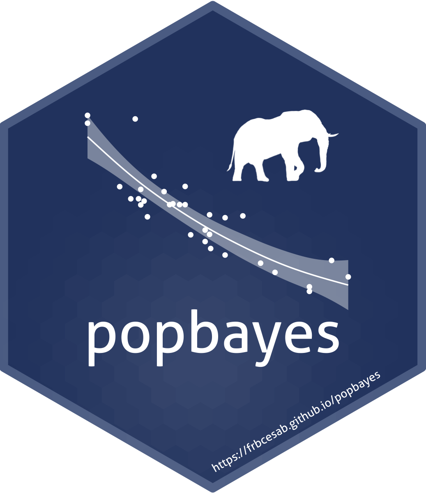

<!-- README.md is generated from README.Rmd. Please edit that file -->


```{r, include = FALSE}
knitr::opts_chunk$set(
  collapse  = TRUE,
  comment   = "#>",
  fig.path  = "man/figures/",
  out.width = "100%"
)
```


popbayes 
=========================================================

<!-- badges: start -->
[](https://CRAN.R-project.org/package=popbayes/)
[](https://CRAN.R-project.org/package=popbayes/)
[](https://github.com/frbcesab/popbayes/actions/workflows/R-CMD-check.yaml)
[](https://github.com/frbcesab/popbayes/actions/workflows/pkgdown.yaml)
[](https://choosealicense.com/licenses/gpl-2.0/)
[](https://lifecycle.r-lib.org/articles/stages.html#stable)
[](https://www.repostatus.org/#active)
[](https://cran.r-project.org/package=popbayes)
<!-- badges: end -->


The goal of the R package `popbayes` is to infer trends of one or several 
populations over time from series of counts. It does so by accounting for count 
precision (provided or inferred based on expert knowledge, e.g. guesstimates), 
smoothing the population rate of increase over time, and accounting for the maximum 
demographic potential of species. Inference is carried out in a Bayesian framework.
This work is part of the FRB-CESAB working group 
[AfroBioDrivers](https://www.fondationbiodiversite.fr/en/the-frb-in-action/programs-and-projects/le-cesab/afrobiodrivers/).


## Installation

**Before using this package, users need to install the freeware 
[JAGS](https://mcmc-jags.sourceforge.io/).**

You can install the stable version of the package from the [CRAN](https://cran.r-project.org) with:

```{r eval = FALSE}
install.packages("popbayes")
```

Alternatively you can install the development version from [GitHub](https://github.com/) with:

```{r eval = FALSE}
# install.packages("remotes")

remotes::install_github("frbcesab/popbayes", build_vignettes = TRUE)
```


## Overview


## Get started

Please read the 
[Get started](https://frbcesab.github.io/popbayes/articles/popbayes.html) 
vignette.


## Citation

Please cite this package as: 

> Casajus N. & Pradel R. (2022) popbayes: Bayesian model to estimate population 
trends from counts series. R package version 1.1. URL: https://frbcesab.github.io/popbayes/.

You can also run:

```{r eval = FALSE}
citation("popbayes")

## A BibTeX entry for LaTeX users is:
## 
## @Manual{,
##   title  = {{popbayes}: {B}ayesian model to estimate population trends from counts series,
##   author = {{Casajus N.}, and {Pradel R.}},
##   year   = {2022},
##   note   = {R package version 1.1},
##   url    = {https://frbcesab.github.io/popbayes/},
## }
```
