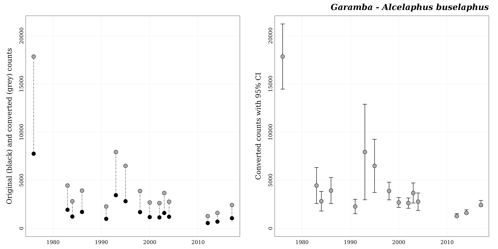
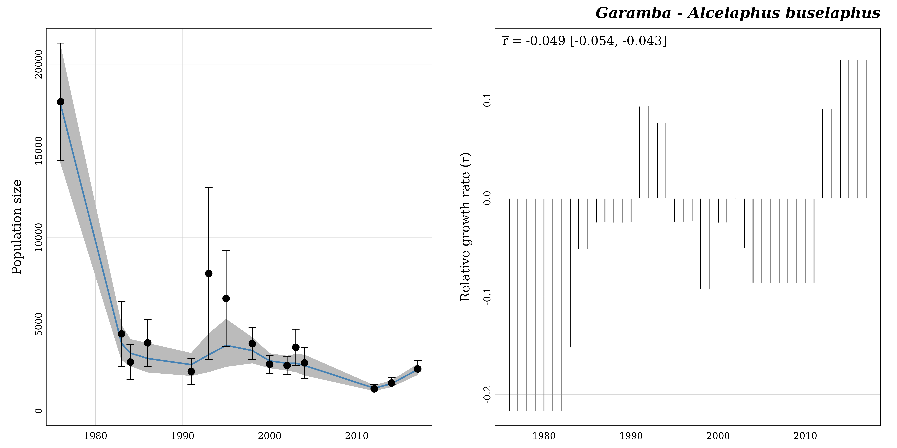

# Get started

The goal of the R package `popbayes` is to fit population trajectories
over time from counts of individuals collected at various dates and with
a variety of methods. It does so under a Bayesian framework where the
primary quantity being modeled is the rate of increase between
successive years (or any other time units for that matter, the one used
for date). The package can deal with multiple species and multiple
locations presented in a single data set, but each **count series** made
of the counts relative to one species at one location will be processed
independently.

The strength of `popbayes` is to handle, in a single series, counts
collected under different types of surveys (aerial vs ground surveys),
and estimated by different census methods (total counts, sampling
counts, and even guesstimates \[i.e. expert estimates\]).

  

**Before using this package, users need to install the freeware
[JAGS](https://mcmc-jags.sourceforge.io/).**

  

The workflow of `popbayes` consists in three main steps:

1.  Formatting data
    ([`format_data()`](https://frbcesab.github.io/popbayes/reference/format_data.md))
2.  Fitting trends
    ([`fit_trend()`](https://frbcesab.github.io/popbayes/reference/fit_trend.md))
3.  Visualizing results
    ([`plot_trend()`](https://frbcesab.github.io/popbayes/reference/plot_trend.md))

The package also provides a lot of functions to handle individual count
series and model outputs. The following figure shows a more complete
usage of the package.

  


Framework of `popbayes`

  

## The Garamba dataset

The package `popbayes` comes with an example dataset: `garamba`. It
contains counts of individuals from 10 African mammal species surveyed
in the Garamba National Park (Democratic Republic of the Congo) from
1976 to 2017.

  

``` r
## Define filename path ----
file_path <- system.file("extdata", "garamba_survey.csv", package = "popbayes")

## Read CSV file ----
garamba <- read.csv(file = file_path)
```

  

| location | species                | date | stat_method | field_method | count | lower_ci | upper_ci | pref_field_method | conversion_A2G |   rmax |
|:--------:|:-----------------------|:----:|:-----------:|:------------:|------:|---------:|---------:|:-----------------:|---------------:|-------:|
| Garamba  | Alcelaphus buselaphus  | 1976 |      S      |      A       |  7750 |     6280 |     9220 |         G         |          2.302 | 0.2748 |
| Garamba  | Alcelaphus buselaphus  | 1983 |      S      |      A       |  1932 |     1120 |     2744 |         G         |          2.302 | 0.2748 |
| Garamba  | Alcelaphus buselaphus  | 1984 |      S      |      A       |  1224 |      782 |     1666 |         G         |          2.302 | 0.2748 |
| Garamba  | Alcelaphus buselaphus  | 1986 |      S      |      A       |  1705 |     1116 |     2294 |         G         |          2.302 | 0.2748 |
| Garamba  | Alcelaphus buselaphus  | 1991 |      S      |      A       |   987 |      663 |     1311 |         G         |          2.302 | 0.2748 |
| Garamba  | Alcelaphus buselaphus  | 1993 |      S      |      A       |  3444 |     1290 |     5598 |         G         |          2.302 | 0.2748 |
| Garamba  | Alcelaphus buselaphus  | 1995 |      S      |      A       |  2819 |     1620 |     4018 |         G         |          2.302 | 0.2748 |
| Garamba  | Alcelaphus buselaphus  | 1998 |      S      |      A       |  1685 |     1287 |     2083 |         G         |          2.302 | 0.2748 |
| Garamba  | Alcelaphus buselaphus  | 2000 |      S      |      A       |  1169 |      945 |     1393 |         G         |          2.302 | 0.2748 |
| Garamba  | Alcelaphus buselaphus  | 2002 |      S      |      A       |  1139 |      907 |     1371 |         G         |          2.302 | 0.2748 |
| Garamba  | Alcelaphus buselaphus  | 2003 |      S      |      A       |  1595 |     1142 |     2048 |         G         |          2.302 | 0.2748 |
| Garamba  | Alcelaphus buselaphus  | 2004 |      S      |      A       |  1204 |      811 |     1597 |         G         |          2.302 | 0.2748 |
| Garamba  | Alcelaphus buselaphus  | 2012 |      T      |      A       |   552 |       NA |       NA |         G         |          2.302 | 0.2748 |
| Garamba  | Alcelaphus buselaphus  | 2014 |      T      |      A       |   698 |       NA |       NA |         G         |          2.302 | 0.2748 |
| Garamba  | Alcelaphus buselaphus  | 2017 |      T      |      A       |  1051 |       NA |       NA |         G         |          2.302 | 0.2748 |
| Garamba  | Giraffa camelopardalis | 1976 |      S      |      A       |   350 |      100 |      600 |         A         |          3.011 | 0.1750 |
| Garamba  | Giraffa camelopardalis | 1983 |      S      |      A       |   175 |       12 |      338 |         A         |          3.011 | 0.1750 |
| Garamba  | Giraffa camelopardalis | 1984 |      S      |      A       |   237 |       93 |      381 |         A         |          3.011 | 0.1750 |
| Garamba  | Giraffa camelopardalis | 1986 |      S      |      A       |   153 |       13 |      293 |         A         |          3.011 | 0.1750 |
| Garamba  | Giraffa camelopardalis | 1991 |      S      |      A       |   346 |      143 |      549 |         A         |          3.011 | 0.1750 |

The Garamba dataset (first 20 rows)

  

This dataset has a typical structure with a location field (`location`),
a species name field (`species`), a date field (`date`), and a count
field (`count`).

  

### Statistical method

In addition to the fields `location`, `species`, `date`, and `count`, a
fourth field is **mandatory**: `stat_method`. This field specifies the
census method that produced the count. It can be `T` for a total count,
`X` for a guesstimate (i.e. expert estimate), or `S` for a sampling
count.

To be usable by the Bayesian model, individual counts are to be
accompanied by information on precision in the form of a 95% confidence
interval. If counts are :

- `T` or `X`, a confidence interval will be computed automatically by
  the function
  [`format_data()`](https://frbcesab.github.io/popbayes/reference/format_data.md)
  according respectively to the following formulas:

$$CI_{(T)} = \lbrack\ 0.95 \times count\ ;1.20 \times count\ \rbrack$$$$CI_{(X)} = \lbrack\ 0.80 \times count\ ;1.20 \times count\ \rbrack$$

- `S`, users **need to supply** a measure of precision. Precision is
  preferably provided in the form of a 95% CI by means of two fields:
  `lower_ci` and `upper_ci` (as in the `garamba` dataset).
  Alternatively, it may also be given in the form of a standard
  deviation (`sd`), a variance (`var`), or a coefficient of variation
  (`cv`). Note that precision metrics can be different between counts.
  For instance, some `S` counts may have an `sd` value and others
  `lower_ci` and `upper_ci`. In that case, three precision columns would
  be required (`lower_ci`, `upper_ci`, and `sd`). An `S` count with no
  measure of precision will be detected as an anomaly by
  [`format_data()`](https://frbcesab.github.io/popbayes/reference/format_data.md)
  by default. The option `na.rm = TRUE` may be used to automatically
  remove such counts from the series. If it is desirable to maintain
  such counts in the count series, we suggest to enter a value for the
  coefficient of variation, e.g. the average coefficient of variation of
  the other counts in the series.

  

### Field method

Another **optional** column, `field_method`, may be provided. It refers
to the type of survey used to collect data. This can be `A` for aerial
survey or `G` for ground survey. This column becomes mandatory as soon
as both field methods are present in a series.

The detectability of a species is indeed strongly dependent on the
survey method and each species has its own *preferred field method*, the
one that is assumed to provide estimates closer to the truth. So, even
if a series is homogeneous relative to the `field method`, it is
recommended to provide the column `field_method` if counts have been
collected under the not preferred field method. That will force
conversion towards the *preferred field method*.

  

### Count conversion

The function
[`format_data()`](https://frbcesab.github.io/popbayes/reference/format_data.md)
will convert counts (and 95% CI bounds) into their equivalent in the
preferred field method for the species. To this aim, two pieces of
information are required :

- `pref_field_method`: the preferred field method for the species (`A`
  or `G`);
- `conversion_A2G`: the multiplicative factor used to convert an aerial
  count into an equivalent ground count.

The package `popbayes` provides the `species_info` dataset, which
contains these two pieces of information for 15 African mammal species.

  

``` r
data("species_info")
```

  

| species                | category | pref_field_method | conversion_A2G |   rmax |
|:-----------------------|:--------:|:-----------------:|---------------:|-------:|
| Aepyceros melampus     |   MLB    |         G         |          6.747 | 0.4010 |
| Alcelaphus buselaphus  |   LLB    |         G         |          2.302 | 0.2748 |
| Connochaetes taurinus  |   LLB    |         G         |          2.302 | 0.2679 |
| Damaliscus lunatus     |   MLB    |         G         |          6.747 | 0.2990 |
| Eudorcas rufifrons     |   MLB    |         G         |          6.747 | 0.5270 |
| Giraffa camelopardalis | Giraffe  |         A         |          3.011 | 0.1750 |
| Hippotragus equinus    |   LLB    |         G         |          2.302 | 0.2420 |
| Kobus ellipsiprymnus   |   MLB    |         G         |          6.747 | 0.2702 |
| Kobus kob              |   MLB    |         G         |          6.747 | 0.3802 |
| Loxodonta africana     | Elephant |         A         |          0.659 | 0.1120 |
| Ourebia ourebi         |   MLB    |         G         |          6.747 | 0.5988 |
| Redunca redunca        |   MLB    |         G         |          6.747 | 0.4010 |
| Syncerus caffer        |    LD    |         A         |          0.561 | 0.2080 |
| Tragelaphus derbianus  |   LLB    |         G         |          2.302 | 0.1500 |
| Tragelaphus scriptus   |   MLB    |         G         |          6.747 | 0.4487 |

Species with count conversion information in popbayes

  

If users work only with species in this table, the package `popbayes`
can automatically retrieve the values of `pref_field_method` and
`conversion_A2G` from the `species_info` data set. But for other
species, users **need to supply** the information themselves when
running
[`format_data()`](https://frbcesab.github.io/popbayes/reference/format_data.md).
These values may be provided as additional fields in the count data set.
Care must then be taken that the same value is consistently repeated for
each count of the same species. For users with sufficient command of R,
we recommend rather to create an independent additional table similar to
`species_info` and to pass it to the function
[`format_data()`](https://frbcesab.github.io/popbayes/reference/format_data.md)
as the data frame argument `info`.

**Note**: Currently
[`format_data()`](https://frbcesab.github.io/popbayes/reference/format_data.md)
takes its information for count conversion from **one source only** with
priority given to `info`, then to additional fields in data (if `info`
is not provided), and eventually to the `species_info` table of the
package (when the other two sources are lacking). That means that the
source with the highest priority must be complete with respect to the
species present in data, as it will be used exclusively to any other
source. If, say, you use `info`, you cannot expect
[`format_data()`](https://frbcesab.github.io/popbayes/reference/format_data.md)
to retrieve conversion information for a species undocumented in `info`
from the `species_info` table of the package. However, you can easily
construct `info` from a copy of `species_info`, which additionally
provides a ready template. It suffices to add any species not already in
`species_info` as shown below.

Let’s assume that, in addition to other species present in the package
`species_info` table, we have counts of *Taurotragus oryx* and
*Taurotragus derbianus*. We can construct `info` as follows.

  

``` r
## Extract the relevant columns of the package table "species_info" ----
info_from_package <- species_info[ , c("species", "pref_field_method", "conversion_A2G", "rmax")]

## Add the new species ----
new_conversion_info <- data.frame("species"           = c("Taurotragus oryx","Taurotragus derbianus"),
                                  "pref_field_method" = "G",
                                  "conversion_A2G"    = 2.302,
                                  "rmax"              = 0.1500)

## Append the new species ----
info <- rbind(info_from_package, new_conversion_info)
info
#>                   species pref_field_method conversion_A2G   rmax
#> 1      Aepyceros melampus                 G          6.747 0.4010
#> 2   Alcelaphus buselaphus                 G          2.302 0.2748
#> 3   Connochaetes taurinus                 G          2.302 0.2679
#> 4      Damaliscus lunatus                 G          6.747 0.2990
#> 5      Eudorcas rufifrons                 G          6.747 0.5270
#> 6  Giraffa camelopardalis                 A          3.011 0.1750
#> 7     Hippotragus equinus                 G          2.302 0.2420
#> 8    Kobus ellipsiprymnus                 G          6.747 0.2702
#> 9               Kobus kob                 G          6.747 0.3802
#> 10     Loxodonta africana                 A          0.659 0.1120
#> 11         Ourebia ourebi                 G          6.747 0.5988
#> 12        Redunca redunca                 G          6.747 0.4010
#> 13        Syncerus caffer                 A          0.561 0.2080
#> 14  Tragelaphus derbianus                 G          2.302 0.1500
#> 15   Tragelaphus scriptus                 G          6.747 0.4487
#> 16       Taurotragus oryx                 G          2.302 0.1500
#> 17  Taurotragus derbianus                 G          2.302 0.1500
```

  

If you do not have conversion information of your own for a new species,
you can rely on the conversion information of species with similar
characteristics (for example the two *Taurotragus* species belong to the
category LLB). The package `popbayes` distinguishes five categories of
species:

- **MLB**: Medium-sized Light and Brown species (20-150kg)
- **LLB**: Large Light and Brown species (\>150kg)
- **LD**: Large Dark (\>150kg)
- **Elephant**
- **Giraffe**

The field `category` of the `species_info` table indicates which species
belong to each.

  

### Relative rate of increase

The demographic potential of a species is limited. The intrinsic rate of
increase (called `rmax`) is the maximum increase in log population size
that a species can attain in a year.

We strongly recommend using the `rmax` values while estimating
population trend to limit yearly population growth estimated by the
model (the default).

  

As for `pref_field_method` and `conversion_A2G`, `rmax` values (specific
to a species) can be provided in an additional field of the count
dataset (`garamba`), as additional field of the `info` data frame, or
internally can be retrieved from the internal dataset of `popbayes`.

  

**How to find the species `rmax` value?**

According to Sinclair (2003), `rmax` is related to the body mass of
adult females `W` by the formula:

$$rmax = 1.375 \times W^{- 0.315}$$

Body masses are found in the literature in publications such as Kingdon
& Hoffman (2013), Cornelis *et al.* (2014), Illius & Gordon (1992),
Sinclair (1996), Suraud *et al.* (2012), or Foley & Faust (2010).

If you know the body mass of adult females of the species, you can
compute the `rmax` value with the function
[`w_to_rmax()`](https://frbcesab.github.io/popbayes/reference/w_to_rmax.md).

  

Alternatively, `rmax` can be obtained from previous demographic
analyses.

  

**Important note**: The intrinsic rate of increase refers to a change
over one year. If a different time unit is used for the dates (say a
month), the rmax to provide must be adapted (here divided by 12). The
**rmax values in popbayes cannot be used for time units other than one
year**.

  

## Checking data

The first thing that the function
[`format_data()`](https://frbcesab.github.io/popbayes/reference/format_data.md)
does is to check the validity of the content of the different fields of
the count data set. Here we will explore our data to avoid errors when
using the function
[`format_data()`](https://frbcesab.github.io/popbayes/reference/format_data.md).

In particular, we need to check `location` and `species` spelling,
`date` and `count` field format, and the `stat_method` and
`field_method` categories.

  

**Check `location` field**

``` r
unique(garamba$"location")
#> [1] "Garamba"

sum(is.na(garamba$"location"))   # Are there any missing values?
#> [1] 0
```

Field **`location`** can be either a `character` or a `factor`. It
**cannot** contain any `NA` values.

  

**Check `species` field**

``` r
unique(garamba$"species")
#>  [1] "Alcelaphus buselaphus"  "Giraffa camelopardalis" "Hippotragus equinus"   
#>  [4] "Kobus ellipsiprymnus"   "Kobus kob"              "Loxodonta africana"    
#>  [7] "Ourebia ourebi"         "Redunca redunca"        "Syncerus caffer"       
#> [10] "Tragelaphus scriptus"

sum(is.na(garamba$"species"))   # Are there any missing values?
#> [1] 0

## Are there species absent from the 'species_info' popbayes dataset?
garamba_species <- unique(garamba$"species")
garamba_species[which(!(garamba_species %in% species_info$"species"))]
#> character(0)
```

Field **`species`** can be either a `character` or a `factor`. It
**cannot** contain any `NA` values.

  

**Check `date` field**

``` r
is.numeric(garamba$"date")     # Are dates in a numerical format?
#> [1] TRUE

sum(is.na(garamba$"date"))     # Are there any missing values?
#> [1] 0

range(garamba$"date")          # What is the temporal extent?
#> [1] 1976 2017
```

Field **`date`** must be a `numeric`. It **cannot** contain any `NA`
values. This said, the time unit is arbitrary, and fractional values of
years (or another unit) are allowed. As long as numeric values are
entered, the package will work.

  

On the other hand, if you have a date format (e.g. ‘2021/05/19’), you
need to convert it to a numeric format. For instance:

``` r
## Convert a character to a date object ----
x <- as.Date("2021/05/19")
x
#> [1] "2021-05-19"

## Convert a date to a numeric (number of days since 1970/01/01) ----
x <- as.numeric(x)
x
#> [1] 18766

## Check ----
as.Date(x, origin = as.Date("1970/01/01"))
#> [1] "2021-05-19"
```

Other methods exist to convert a `date` to a `numeric` format. You may
prefer computing the number of days since the first date of your survey.
It’s up to you.

  

**Check `count` field**

``` r
is.numeric(garamba$"count")   # Are counts in a numerical format?
#> [1] TRUE

range(garamba$"count")        # What is the range of values?
#> [1]     0 53312

sum(is.na(garamba$"count"))   # Are there any missing values?
#> [1] 0
```

Field **`count`** must be a **positive** `numeric` (zero counts are
allowed). `NA` counts cannot be used for fitting trends. The
[`format_data()`](https://frbcesab.github.io/popbayes/reference/format_data.md)
function (see below) has an option for dropping them.

  

**Check `stat_method` field**

``` r
unique(garamba$"stat_method")
#> [1] "S" "T"

sum(is.na(garamba$"stat_method"))   # Are there any missing values?
#> [1] 0
```

Field **`stat_method`** can be either a `character` or a `factor`. It
**must** contain only `T`, `X`, or `S` categories and **cannot** contain
any `NA` values.

  

**Check `field_method` field**

``` r
unique(garamba$"field_method")
#> [1] "A"

sum(is.na(garamba$"field_method"))   # Are there any missing values?
#> [1] 0
```

Field **`field_method`** can be either a `character` or a `factor`. It
**must** contain only `A`, or `G` categories and **cannot** contain any
`NA` values.

  

## Formatting data

This first `popbayes` function to use is
[`format_data()`](https://frbcesab.github.io/popbayes/reference/format_data.md).
This function provides an easy way to get individual count series ready
to be analyzed by the package. It must be **used prior to** all other
functions.

  

First let’s define the path (relative or absolute) to save
objects/results, namely the formatted count series that can be extracted
from the data set.

``` r
path <- "the_folder_to_store_outputs"
```

  

The function
[`format_data()`](https://frbcesab.github.io/popbayes/reference/format_data.md)
has many arguments to provide the names of the columns in the user’s
dataset that contain `location`, `species`, `lower_ci`, etc. By default
column names are the same as in the Garamba dataset. If your location
field, say, is “site”, you’ll need to use the argument `location` as
follows: `location = "site"`.

  

``` r
garamba_formatted <- popbayes::format_data(data              = garamba, 
                                           path              = path,
                                           field_method      = "field_method",
                                           pref_field_method = "pref_field_method",
                                           conversion_A2G    = "conversion_A2G",
                                           rmax              = "rmax")
#> ✔ Detecting 10 count series.
```

  

As said above, if you have to add your own count conversion data, you
need specify the names of columns for the preferred field method, the
conversion factor, and rmax as this:
`pref_field_method = "column_with_preferred_field_method"`,
`conversion_A2G = "column_with_conversion_A2Gor"`,
`rmax = "column_with_conversion_rmax"`, or alternatively use the
argument `info`: `info = "dataframe_with_conversion_info"`.

  

Let’s explore the output.

``` r
## Class of the object ----
class(garamba_formatted)
#> [1] "list"

## Number of elements (i.e. number of count series) ----
length(garamba_formatted)
#> [1] 10

## Get series names ----
popbayes::list_series(path)
#>  [1] "garamba__alcelaphus_buselaphus"  "garamba__giraffa_camelopardalis"
#>  [3] "garamba__hippotragus_equinus"    "garamba__kobus_ellipsiprymnus"  
#>  [5] "garamba__kobus_kob"              "garamba__loxodonta_africana"    
#>  [7] "garamba__ourebia_ourebi"         "garamba__redunca_redunca"       
#>  [9] "garamba__syncerus_caffer"        "garamba__tragelaphus_scriptus"
```

  

Let’s work with the count series `"garamba__alcelaphus_buselaphus"`. We
can use the function
[`filter_series()`](https://frbcesab.github.io/popbayes/reference/filter_series.md).

``` r
## Retrieve series by species and location ----
a_buselaphus <- popbayes::filter_series(data     = garamba_formatted, 
                                        species  = "Alcelaphus buselaphus",
                                        location = "Garamba")
#> ✔ Found 1 series with "Alcelaphus buselaphus" and "Garamba".
```

  

Let’s display the series content.

``` r
print(a_buselaphus)
#> $garamba__alcelaphus_buselaphus
#> $garamba__alcelaphus_buselaphus$location
#> [1] "Garamba"
#> 
#> $garamba__alcelaphus_buselaphus$species
#> [1] "Alcelaphus buselaphus"
#> 
#> $garamba__alcelaphus_buselaphus$dates
#>  [1] 1976 1983 1984 1986 1991 1993 1995 1998 2000 2002 2003 2004 2012 2014 2017
#> 
#> $garamba__alcelaphus_buselaphus$n_dates
#> [1] 15
#> 
#> $garamba__alcelaphus_buselaphus$stat_methods
#> [1] "S" "T"
#> 
#> $garamba__alcelaphus_buselaphus$field_methods
#> [1] "A"
#> 
#> $garamba__alcelaphus_buselaphus$pref_field_method
#> [1] "G"
#> 
#> $garamba__alcelaphus_buselaphus$conversion_A2G
#> [1] 2.302
#> 
#> $garamba__alcelaphus_buselaphus$rmax
#> [1] 0.2748
#> 
#> $garamba__alcelaphus_buselaphus$data_original
#>    location               species date stat_method field_method
#> 1   Garamba Alcelaphus buselaphus 1976           S            A
#> 2   Garamba Alcelaphus buselaphus 1983           S            A
#> 3   Garamba Alcelaphus buselaphus 1984           S            A
#> 4   Garamba Alcelaphus buselaphus 1986           S            A
#> 5   Garamba Alcelaphus buselaphus 1991           S            A
#> 6   Garamba Alcelaphus buselaphus 1993           S            A
#> 7   Garamba Alcelaphus buselaphus 1995           S            A
#> 8   Garamba Alcelaphus buselaphus 1998           S            A
#> 9   Garamba Alcelaphus buselaphus 2000           S            A
#> 10  Garamba Alcelaphus buselaphus 2002           S            A
#> 11  Garamba Alcelaphus buselaphus 2003           S            A
#> 12  Garamba Alcelaphus buselaphus 2004           S            A
#> 13  Garamba Alcelaphus buselaphus 2012           T            A
#> 14  Garamba Alcelaphus buselaphus 2014           T            A
#> 15  Garamba Alcelaphus buselaphus 2017           T            A
#>    pref_field_method conversion_A2G   rmax count_orig lower_ci_orig
#> 1                  G          2.302 0.2748       7750          6280
#> 2                  G          2.302 0.2748       1932          1120
#> 3                  G          2.302 0.2748       1224           782
#> 4                  G          2.302 0.2748       1705          1116
#> 5                  G          2.302 0.2748        987           663
#> 6                  G          2.302 0.2748       3444          1290
#> 7                  G          2.302 0.2748       2819          1620
#> 8                  G          2.302 0.2748       1685          1287
#> 9                  G          2.302 0.2748       1169           945
#> 10                 G          2.302 0.2748       1139           907
#> 11                 G          2.302 0.2748       1595          1142
#> 12                 G          2.302 0.2748       1204           811
#> 13                 G          2.302 0.2748        552            NA
#> 14                 G          2.302 0.2748        698            NA
#> 15                 G          2.302 0.2748       1051            NA
#>    upper_ci_orig
#> 1           9220
#> 2           2744
#> 3           1666
#> 4           2294
#> 5           1311
#> 6           5598
#> 7           4018
#> 8           2083
#> 9           1393
#> 10          1371
#> 11          2048
#> 12          1597
#> 13            NA
#> 14            NA
#> 15            NA
#> 
#> $garamba__alcelaphus_buselaphus$data_converted
#>    location               species date stat_method field_method
#> 1   Garamba Alcelaphus buselaphus 1976           S            A
#> 2   Garamba Alcelaphus buselaphus 1983           S            A
#> 3   Garamba Alcelaphus buselaphus 1984           S            A
#> 4   Garamba Alcelaphus buselaphus 1986           S            A
#> 5   Garamba Alcelaphus buselaphus 1991           S            A
#> 6   Garamba Alcelaphus buselaphus 1993           S            A
#> 7   Garamba Alcelaphus buselaphus 1995           S            A
#> 8   Garamba Alcelaphus buselaphus 1998           S            A
#> 9   Garamba Alcelaphus buselaphus 2000           S            A
#> 10  Garamba Alcelaphus buselaphus 2002           S            A
#> 11  Garamba Alcelaphus buselaphus 2003           S            A
#> 12  Garamba Alcelaphus buselaphus 2004           S            A
#> 13  Garamba Alcelaphus buselaphus 2012           T            A
#> 14  Garamba Alcelaphus buselaphus 2014           T            A
#> 15  Garamba Alcelaphus buselaphus 2017           T            A
#>    pref_field_method conversion_A2G   rmax count_conv lower_ci_conv
#> 1                  G          2.302 0.2748  17840.500     14456.560
#> 2                  G          2.302 0.2748   4447.464      2578.240
#> 3                  G          2.302 0.2748   2817.648      1800.164
#> 4                  G          2.302 0.2748   3924.910      2569.032
#> 5                  G          2.302 0.2748   2272.074      1526.226
#> 6                  G          2.302 0.2748   7928.088      2969.580
#> 7                  G          2.302 0.2748   6489.338      3729.240
#> 8                  G          2.302 0.2748   3878.870      2962.674
#> 9                  G          2.302 0.2748   2691.038      2175.390
#> 10                 G          2.302 0.2748   2621.978      2087.914
#> 11                 G          2.302 0.2748   3671.690      2628.884
#> 12                 G          2.302 0.2748   2771.608      1866.922
#> 13                 G          2.302 0.2748   1270.704      1207.169
#> 14                 G          2.302 0.2748   1606.796      1526.456
#> 15                 G          2.302 0.2748   2419.402      2298.432
#>    upper_ci_conv field_method_conv
#> 1      21224.440                 G
#> 2       6316.688                 G
#> 3       3835.132                 G
#> 4       5280.788                 G
#> 5       3017.922                 G
#> 6      12886.596                 G
#> 7       9249.436                 G
#> 8       4795.066                 G
#> 9       3206.686                 G
#> 10      3156.042                 G
#> 11      4714.496                 G
#> 12      3676.294                 G
#> 13      1524.845                 G
#> 14      1928.155                 G
#> 15      2903.282                 G
```

  

The first elements of the list provide a summary of the count series.

If we compare the two last data frames (`data_original` and
`data_converted`), they are not identical. The function
[`format_data()`](https://frbcesab.github.io/popbayes/reference/format_data.md)
has **1)** computed 95% CI boundaries for total counts (coded `T` in the
column `stat_method`), and **2)** converted all counts (and CI
boundaries) to their equivalent in the preferred field method (from `A`
to `G`) by applying the conversion factor of `2.302`.

The Bayesian model will use counts and precision measures from the
`data_converted` data frame.

  

Before fitting the population size trend we can visualize the count
series with
[`plot_series()`](https://frbcesab.github.io/popbayes/reference/plot_series.md).

  

``` r
popbayes::plot_series("garamba__alcelaphus_buselaphus", path = path)
```



  

The function
[`format_data()`](https://frbcesab.github.io/popbayes/reference/format_data.md)
has also exported the count series as `.RData` files in the `path`
folder where they have been dispatched into sub-folders, one per series.

``` r
list.files(path, recursive = TRUE)
```

    #>  [1] "garamba__alcelaphus_buselaphus/garamba__alcelaphus_buselaphus_data.RData"  
    #>  [2] "garamba__giraffa_camelopardalis/garamba__giraffa_camelopardalis_data.RData"
    #>  [3] "garamba__hippotragus_equinus/garamba__hippotragus_equinus_data.RData"      
    #>  [4] "garamba__kobus_ellipsiprymnus/garamba__kobus_ellipsiprymnus_data.RData"    
    #>  [5] "garamba__kobus_kob/garamba__kobus_kob_data.RData"                          
    #>  [6] "garamba__loxodonta_africana/garamba__loxodonta_africana_data.RData"        
    #>  [7] "garamba__ourebia_ourebi/garamba__ourebia_ourebi_data.RData"                
    #>  [8] "garamba__redunca_redunca/garamba__redunca_redunca_data.RData"              
    #>  [9] "garamba__syncerus_caffer/garamba__syncerus_caffer_data.RData"              
    #> [10] "garamba__tragelaphus_scriptus/garamba__tragelaphus_scriptus_data.RData"

  

These `*_data.RData` files (count series) can be imported later by
running the function
[`read_series()`](https://frbcesab.github.io/popbayes/reference/read_series.md).

``` r
a_buselaphus <- popbayes::read_series("garamba__alcelaphus_buselaphus", path = path)
```

  

## Fitting trend

The function
[`fit_trend()`](https://frbcesab.github.io/popbayes/reference/fit_trend.md)
fits population trajectories over time from counts of individuals
formatted by
[`format_data()`](https://frbcesab.github.io/popbayes/reference/format_data.md).
It does so under a Bayesian framework where the primary quantity being
modeled is the annual rate of increase (more generally, the rate of
increase per the time unit used for dates).

This function only works on the output of
[`format_data()`](https://frbcesab.github.io/popbayes/reference/format_data.md)
(or
[`filter_series()`](https://frbcesab.github.io/popbayes/reference/filter_series.md)).

Here is the default usage of the function
[`fit_trend()`](https://frbcesab.github.io/popbayes/reference/fit_trend.md):

  

``` r
a_buselaphus_bugs <- popbayes::fit_trend(a_buselaphus, path = path)
```

  

The function returns an n-element list (where n is the number of count
series). Each element of the list is a BUGS output as provided by JAGS.
It has also exported these BUGS outputs as `.RData` files in the `path`
folder where they have been dispatched into sub-folders, one per series.

  

These `*_bugs.RData` files (BUGS outputs) can be imported later by
running the function
[`read_bugs()`](https://frbcesab.github.io/popbayes/reference/read_bugs.md).

``` r
a_buselaphus_bugs <- popbayes::read_bugs("garamba__alcelaphus_buselaphus", path = path)
```

  

The function
[`diagnostic()`](https://frbcesab.github.io/popbayes/reference/diagnostic.md)
allows to check if estimation of all parameters of the model has
converged. This diagnostic is performed by comparing the `Rhat` value of
each parameter to a `threshold` (default is `1.1`).

  

``` r
popbayes::diagnostic(a_buselaphus_bugs)
#> All models have converged.
```

In case convergence was not reached for some series, we suggest
rerunning
[`fit_trend()`](https://frbcesab.github.io/popbayes/reference/fit_trend.md)
on these series after increasing the number of iterations (**ni**) and
possibly the number of initial iterations discarded (**nb**) from their
respective defaults of 50,000 and 10,000. For example:

``` r
a_buselaphus_bugs <- popbayes::fit_trend(a_buselaphus, path = path, ni = 100000, nb = 20000)
```

This process may be repeated with increasing values of **ni** and **nb**
until convergence is eventually reached.

  

Finally we can use the function
[`plot_trend()`](https://frbcesab.github.io/popbayes/reference/plot_trend.md)
to visualize model predictions and estimated yearly relative growth
rates.

  

``` r
popbayes::plot_trend("garamba__alcelaphus_buselaphus", path = path)
```



  

## References

- Cornelis D *et al.* (2014) Species account: African buffalo (*Syncerus
  caffer*). In: *Ecology, Evolution and Behaviour of Wild Cattle:
  Implications for Conservation* (Eds M Melletti & J Burton). Cambridge
  University Press, Cambridge. DOI:
  [10.1017/CBO9781139568098](https://doi.org/10.1017/CBO9781139568098).

- Foley CAH & Faust LJ (2010) Rapid population growth in an elephant
  *Loxodonta africana* population recovering from poaching in Tarangire
  National Park, Tanzania. *Oryx*, **44**, 205-212. DOI:
  [10.1017/S0030605309990706](https://doi.org/10.1017/S0030605309990706).

- Illius AW & Gordon IJ (1992) Modelling the nutritional ecology of
  ungulate herbivores: evolution of body size and competitive
  interactions. *Oecologia*, **89**, 428-434. DOI:
  [10.1017/S0030605309990706](https://doi.org/10.1007/BF00317422).

- Kingdon J & Hoffman M (2013) *Mammals of Africa. Volume VI: Pigs,
  Hippopotamuses, Chevrotain, Giraffes, Deer and Bovids*. Bloomsbury
  Publishing, London, United Kingdom, 680 pp.

- Sinclair ARE (1996) Mammal populations: fluctuation, regulation, life
  history theory, and their implications for conservation. In:
  *Frontiers of population ecology* (Eds RB Floyd & AW Sheppard),
  pp. 127-154. CSIRO: Melbourne, Australia.

- Sinclair ARE (2003) Mammal population regulation, keystone processes
  and ecosystem dynamics. *Philosophical Transactions: Biological
  Sciences*, **358**, 1729-1740. DOI:
  [10.1098/rstb.2003.1359](https://doi.org/10.1098/rstb.2003.1359).

- Suraud JP *et al.* (2012) Higher than expected growth rate of the
  endangered West African giraffe *Giraffa camelopardalis peralta*: a
  successful human-wildlife cohabitation. *Oryx*, **46**, 577-583. DOI:
  [10.1017/S0030605311000639](https://doi.org/10.1017/S0030605311000639).
