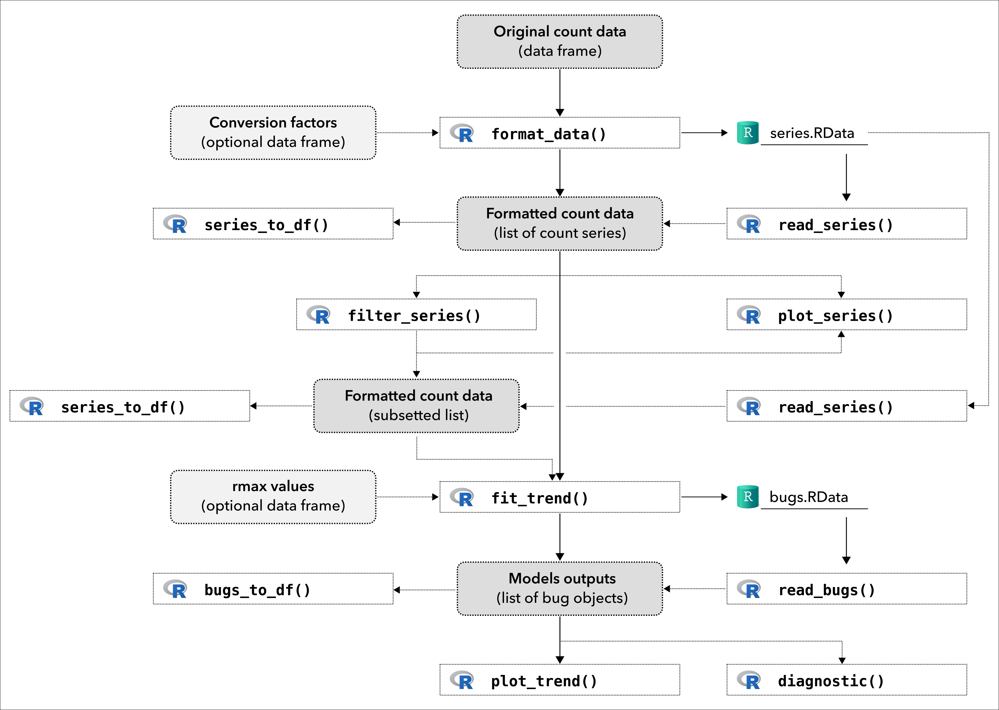

# popbayes

The goal of the R package `popbayes` is to infer trends of one or
several populations over time from series of counts. It does so by
accounting for count precision (provided or inferred based on expert
knowledge, e.g. guesstimates), smoothing the population rate of increase
over time, and accounting for the maximum demographic potential of
species. Inference is carried out in a Bayesian framework. This work is
part of the FRB-CESAB working group
[AfroBioDrivers](https://www.fondationbiodiversite.fr/en/the-frb-in-action/programs-and-projects/le-cesab/afrobiodrivers/).

## Installation

**Before using this package, users need to install the freeware
[JAGS](https://mcmc-jags.sourceforge.io/).**

You can install the stable version of the package from the
[CRAN](https://cran.r-project.org) with:

``` r
install.packages("popbayes")
```

Alternatively you can install the development version from
[GitHub](https://github.com/) with:

``` r
# install.packages("remotes")

remotes::install_github("frbcesab/popbayes", build_vignettes = TRUE)
```

## Overview



## Get started

Please read the [Get
started](https://frbcesab.github.io/popbayes/articles/popbayes.html)
vignette.

## Citation

Please cite this package as:

> Casajus N. & Pradel R. (2023) popbayes: Bayesian model to estimate
> population trends from counts series. R package version 1.2.0. URL:
> <https://frbcesab.github.io/popbayes/>.

You can also run:

``` r
citation("popbayes")

## A BibTeX entry for LaTeX users is:
## 
## @Manual{,
##   title  = {{popbayes}: {B}ayesian model to estimate population trends from counts series,
##   author = {{Casajus N.}, and {Pradel R.}},
##   year   = {2023},
##   note   = {R package version 1.2.0},
##   url    = {https://frbcesab.github.io/popbayes/},
## }
```
