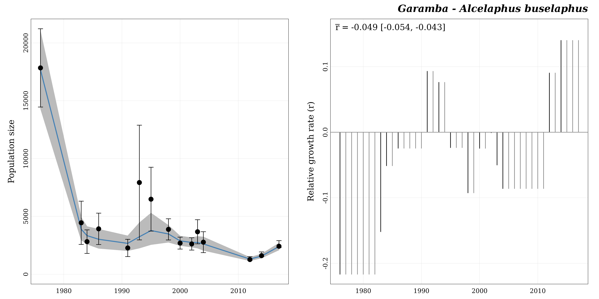

```{r, include = FALSE}
knitr::opts_chunk$set(
  collapse   = TRUE,
  comment    = "#>",
  fig.width  = 7,
  fig.height = 7,
  out.width  = "100%",
  dpi        = 300
)
```

```{r 'setup', echo = FALSE}
library("popbayes")
```

The goal of the R package `popbayes` is to fit population trajectories over time 
from counts of individuals collected at various dates and with a variety of 
methods. It does so under a Bayesian framework where the primary quantity being 
modeled is the rate of increase between successive years (or any other time units 
for that matter, the one used for date). The package can deal with multiple 
species and multiple locations presented in a single data set, but each 
**count series** made of the counts relative to one species at one location 
will be processed independently.

The strength of `popbayes` is to handle, in a single series, counts collected 
under different types of surveys (aerial vs ground surveys), and estimated by 
different census methods (total counts, sampling counts, and even guesstimates 
[i.e. expert estimates]).


<br />

**Before using this package, users need to install the freeware 
[JAGS](https://mcmc-jags.sourceforge.io/).**

<br />


The workflow of `popbayes` consists in three main steps:

1. Formatting data (`format_data()`)
2. Fitting trends (`fit_trend()`)
3. Visualizing results (`plot_trend()`)

The package also provides a lot of functions to handle individual count series 
and model outputs. The following figure shows a more complete usage of the 
package.


<br />


```{r, echo = FALSE, out.width = "100%", fig.cap = "Framework of `popbayes`", fig.align = 'center'}
knitr::include_graphics("docs/popbayes-diagram.png")
```


<br />


## The Garamba dataset


The package `popbayes` comes with an example dataset: `garamba`. It contains 
counts of individuals from 10 African mammal species surveyed in the Garamba 
National Park (Democratic Republic of the Congo) from 1976 to 2017.


<br />

```{r 'load-data'}
## Define filename path ----
file_path <- system.file("extdata", "garamba_survey.csv", package = "popbayes")

## Read CSV file ----
garamba <- read.csv(file = file_path)
```

<br />

```{r 'print-data', echo = FALSE}
knitr::kable(head(garamba, 20), caption = "The Garamba dataset (first 20 rows)", 
             align = c("c", "l", "c", "c", "c", "r", "r", "r", "c", "r", "r"))
```


<br />


This dataset has a typical structure with a location field (`location`), a 
species name field (`species`), a date field (`date`), and a count
field (`count`).  

<br />

### Statistical method

In addition to the fields `location`, `species`, `date`, and `count`, a fourth 
field is **mandatory**: `stat_method`. This field specifies the 
census method that produced the count. It can be `T` for a total 
count, `X` for a guesstimate (i.e. expert estimate), or `S` for a sampling count.

To be usable by the Bayesian model, individual counts are to be accompanied 
by information on precision in the form of a 95% confidence interval. If counts 
are :

- `T` or `X`, a confidence interval will be computed automatically by the 
function `format_data()` according respectively to the following formulas:

$$ CI_{(T)} = [\ 0.95 \times count\ ; 1.20 \times count\ ] $$
$$ CI_{(X)} = [\ 0.80 \times count\ ; 1.20 \times count\ ] $$

- `S`, users **need to supply** a measure of precision. Precision 
is preferably provided in the form of a 95% CI by means of two fields: `lower_ci` 
and `upper_ci` (as in the `garamba` dataset). Alternatively, it may also be given 
in the form of a standard deviation (`sd`), a variance (`var`), or a 
coefficient of variation (`cv`). Note that precision metrics can be different 
between counts. For instance, some `S` counts may have an `sd` value and others 
`lower_ci` and `upper_ci`. In that case, three precision columns would be required
(`lower_ci`, `upper_ci`, and `sd`). An `S` count with no measure of precision will 
be detected as an anomaly by `format_data()` by default. The option `na.rm = TRUE`
may be used to automatically remove such counts from the series. If it is 
desirable to maintain such counts in the count series, we suggest to enter a 
value for the coefficient of variation, e.g. the average coefficient of variation 
of the other counts in the series.   


<br />

### Field method

Another **optional** column, `field_method`, may be provided. It refers to the 
type of survey used to collect data. This can be `A` for aerial survey or `G` 
for ground survey. This column becomes mandatory as soon as both field methods 
are present in a series.

The detectability of a species is indeed strongly dependent on the survey method 
and each species has its own _preferred field method_, the one that is assumed 
to provide estimates closer to the truth. So, even if a series is homogeneous 
relative to the `field method`, it is recommended to provide the column 
`field_method` if counts have been collected under the not preferred 
field method. That will force conversion towards the _preferred field method_.


<br />

### Count conversion

The function `format_data()` will convert counts (and 95% CI bounds) into their 
equivalent in the preferred field method for the species. To this aim, two 
pieces of information are required :

- `pref_field_method`: the preferred field method for the species (`A` or `G`);
- `conversion_A2G`: the multiplicative factor used to convert an aerial count 
into an equivalent ground count.

The package `popbayes` provides the `species_info` dataset, which contains
these two pieces of information for 15 African mammal species. 

<br />

```{r 'load-data-2'}
data("species_info")
```

<br />

```{r 'print-data-2', echo = FALSE}
knitr::kable(species_info[ , c(3, 6, 7, 8, 9)], 
             caption = "Species with count conversion information in popbayes", 
             align = c("l", "c", "c", "r", "r"))
```

<br />

If users work only with species in this table, the package `popbayes` can 
automatically retrieve the values of `pref_field_method` and `conversion_A2G` 
from the `species_info` data set. But for other species, users 
**need to supply** the information themselves when running `format_data()`. 
These values may be provided as additional fields in the count data set. Care 
must then be taken that the same value is consistently repeated for each count 
of the same species. For users with sufficient command of R, we recommend rather 
to create an independent additional table similar to `species_info` and to 
pass it to the function `format_data()` as the data frame argument `info`. 

**Note**: Currently `format_data()` takes its information for count conversion 
from **one source only** with priority given to `info`, then to additional 
fields in data (if `info` is not provided), and eventually to the 
`species_info` table of the package (when the other two sources are lacking). 
That means that the source with the highest priority must be complete with 
respect to the species present in data, as it will be used exclusively to any 
other source. If, say, you use `info`, you cannot expect `format_data()` to 
retrieve conversion information for a species undocumented in `info` from the 
`species_info` table of the package. However, you can easily construct `info` 
from a copy of `species_info`, which additionally provides a ready template. 
It suffices to add any species not already in `species_info` as shown below.

Let's assume that, in addition to other species present in the package 
`species_info` table, we have counts of _Taurotragus oryx_ and 
_Taurotragus derbianus_. We can construct `info` as follows. 


<br />


```{r 'create-info'}
## Extract the relevant columns of the package table "species_info" ----
info_from_package <- species_info[ , c("species", "pref_field_method", "conversion_A2G", "rmax")]

## Add the new species ----
new_conversion_info <- data.frame("species"           = c("Taurotragus oryx","Taurotragus derbianus"),
                                  "pref_field_method" = "G",
                                  "conversion_A2G"    = 2.302,
                                  "rmax"              = 0.1500)

## Append the new species ----
info <- rbind(info_from_package, new_conversion_info)
info
```

<br />

If you do not have conversion information of your own for a new species, you 
can rely on the conversion information of species with similar characteristics
(for example the two _Taurotragus_ species belong to the category LLB). 
The package `popbayes` distinguishes five categories of species:

- **MLB**: Medium-sized Light and Brown species (20-150kg)
- **LLB**: Large Light and Brown species (>150kg)
- **LD**: Large Dark (>150kg)
- **Elephant**
- **Giraffe**

The field `category` of the `species_info` table indicates which species 
belong to each.


<br />

### Relative rate of increase

The demographic potential of a species is limited. The intrinsic rate of 
increase (called `rmax`) is the maximum increase in log population size that a 
species can attain in a year.

We strongly recommend using the `rmax` values while estimating population trend
to limit yearly population growth estimated by the model (the default).

<br />

As for `pref_field_method` and `conversion_A2G`, `rmax` values (specific to a
species) can be provided in an additional field of the count dataset (`garamba`),
as additional field of the `info` data frame, or internally can be retrieved 
from the internal dataset of `popbayes`.

<br />

**How to find the species `rmax` value?**

According to Sinclair (2003), `rmax` is related to the body mass of adult 
females `W`  by the formula:

$$ rmax = 1.375 \times W^{-0.315} $$

Body masses are found in the literature in publications such as Kingdon & 
Hoffman (2013), Cornelis _et al._ (2014), Illius & Gordon (1992), 
Sinclair (1996), Suraud _et al._ (2012), or Foley & Faust (2010). 

If you know the body mass of adult females of the species, you can compute the
`rmax` value with the function `w_to_rmax()`.

<br />

Alternatively, `rmax` can be obtained from previous demographic analyses.

<br />

**Important note**: The intrinsic rate of increase refers to a change over one 
year. If a different time unit is used for the dates (say a month), the rmax to
provide must be adapted (here divided by 12). The **rmax values in popbayes cannot 
be used for time units other than one year**.

<br />


## Checking data


The first thing that the function `format_data()` does is to check the validity 
of the content of the different fields of the count data set. Here we will 
explore our data to avoid errors when using the function `format_data()`.

In particular, we need to check `location` and `species` spelling, `date` and 
`count` field format, and the `stat_method` and `field_method` categories.


<br />

**Check `location` field**

```{r 'check-location'}
unique(garamba$"location")

sum(is.na(garamba$"location"))   # Are there any missing values?
```

Field **`location`** can be either a `character` or a `factor`. It **cannot** 
contain any `NA` values.


<br />

**Check `species` field**

```{r 'check-species'}
unique(garamba$"species")

sum(is.na(garamba$"species"))   # Are there any missing values?

## Are there species absent from the 'species_info' popbayes dataset?
garamba_species <- unique(garamba$"species")
garamba_species[which(!(garamba_species %in% species_info$"species"))]
```

Field **`species`** can be either a `character` or a `factor`. It **cannot** 
contain any `NA` values.


<br />

**Check `date` field**

```{r 'check-date'}
is.numeric(garamba$"date")     # Are dates in a numerical format?

sum(is.na(garamba$"date"))     # Are there any missing values?

range(garamba$"date")          # What is the temporal extent?
```

Field **`date`** must be a `numeric`. It **cannot** contain any `NA` values. 
This said, the time unit is arbitrary, and fractional values of years (or 
another unit) are allowed. As long as numeric values are entered, the package 
will work.

<br />

On the other hand, if you have a date format (e.g. '2021/05/19'), you need to 
convert it to a numeric format. For instance:

```{r 'convert-date'}
## Convert a character to a date object ----
x <- as.Date("2021/05/19")
x

## Convert a date to a numeric (number of days since 1970/01/01) ----
x <- as.numeric(x)
x

## Check ----
as.Date(x, origin = as.Date("1970/01/01"))
```

Other methods exist to convert a `date` to a `numeric` format. You may prefer 
computing the number of days since the first date of your survey. It's up to you.


<br />

**Check `count` field**

```{r 'check-counts'}
is.numeric(garamba$"count")   # Are counts in a numerical format?

range(garamba$"count")        # What is the range of values?

sum(is.na(garamba$"count"))   # Are there any missing values?
```

Field **`count`** must be a **positive** `numeric` (zero counts are allowed).
`NA` counts cannot be used for fitting trends. The `format_data()` function 
(see below) has an option for dropping them.


<br />

**Check `stat_method` field**

```{r 'check-stat'}
unique(garamba$"stat_method")

sum(is.na(garamba$"stat_method"))   # Are there any missing values?
```

Field **`stat_method`** can be either a `character` or a `factor`. It **must**
contain only `T`, `X`, or `S` categories and **cannot** contain any `NA` values.


<br />

**Check `field_method` field**

```{r 'check-field'}
unique(garamba$"field_method")

sum(is.na(garamba$"field_method"))   # Are there any missing values?
```

Field **`field_method`** can be either a `character` or a `factor`. It **must**
contain only `A`, or `G` categories and **cannot** contain any `NA` values.


<br />


## Formatting data

This first `popbayes` function to use is `format_data()`. This function 
provides an easy way to get individual count series ready to be analyzed by 
the package. It must be **used prior to** all other functions.


<br />

First let's define the path (relative or absolute) to save objects/results, 
namely the formatted count series that can be extracted from the data set.

```{r 'define-path-1', eval = TRUE, echo = FALSE}
path <- tempdir()
```

```{r 'define-path-2', eval = FALSE, echo = TRUE}
path <- "the_folder_to_store_outputs"
```


<br />

The function `format_data()` has many arguments to provide the names of the 
columns in the user's dataset that contain `location`, `species`, `lower_ci`, 
etc. By default column names are the same as in the Garamba dataset. If your 
location field, say, is "site", you'll need to use the argument `location` as 
follows: `location = "site"`.


<br />

```{r 'format-data'}
garamba_formatted <- popbayes::format_data(data              = garamba, 
                                           path              = path,
                                           field_method      = "field_method",
                                           pref_field_method = "pref_field_method",
                                           conversion_A2G    = "conversion_A2G",
                                           rmax              = "rmax")
```

<br />


As said above, if you have to add your own count conversion data, you need 
specify the names of columns for the preferred field method, the conversion 
factor, and rmax as this:
`pref_field_method = "column_with_preferred_field_method"`, 
`conversion_A2G = "column_with_conversion_A2Gor"`, 
`rmax = "column_with_conversion_rmax"`,
or alternatively use the argument `info`:
`info = "dataframe_with_conversion_info"`.

<br />

Let's explore the output.

```{r 'explore-series'}
## Class of the object ----
class(garamba_formatted)

## Number of elements (i.e. number of count series) ----
length(garamba_formatted)

## Get series names ----
popbayes::list_series(path)
```

<br />

Let's work with the count series `"garamba__alcelaphus_buselaphus"`. We can use
the function `filter_series()`.

```{r 'filter-series'}
## Retrieve series by species and location ----
a_buselaphus <- popbayes::filter_series(data     = garamba_formatted, 
                                        species  = "Alcelaphus buselaphus",
                                        location = "Garamba")
```

<br />

Let's display the series content.

```{r 'print-series'}
print(a_buselaphus)
```

<br />

The first elements of the list provide a summary of the count series.

If we compare the two last data frames (`data_original` and `data_converted`), 
they are not identical. The function `format_data()` has **1)** computed 
95% CI boundaries for total counts (coded `T` in the column `stat_method`), and 
**2)** converted all counts (and CI boundaries) to their equivalent in the 
preferred field method (from `A` to `G`) by applying the conversion factor of 
`2.302`.

The Bayesian model will use counts and precision measures from the 
`data_converted` data frame.

<br />

Before fitting the population size trend we can visualize the count series with 
`plot_series()`.

<br />

```{r 'plot-series-1', fig.width=12, fig.height=6, out.width="100%"}
popbayes::plot_series("garamba__alcelaphus_buselaphus", path = path)
```

<br />


The function `format_data()` has also exported the count series as `.RData` 
files in the `path` folder where they have been dispatched into sub-folders, 
one per series.


```{r 'list-folder-1', echo = TRUE, eval = FALSE}
list.files(path, recursive = TRUE)
```

```{r 'list-folder-2', echo = FALSE, eval = TRUE}
list.files(path, recursive = TRUE, pattern = "^garamba__")
```


<br />

These `*_data.RData` files (count series) can be imported later by running the 
function `read_series()`.


```{r 'read-series', eval = FALSE}
a_buselaphus <- popbayes::read_series("garamba__alcelaphus_buselaphus", path = path)
```


<br />


## Fitting trend


The function `fit_trend()` fits population trajectories over time 
from counts of individuals formatted by `format_data()`. It does so under a 
Bayesian framework where the primary quantity being modeled is the annual rate 
of increase (more generally, the rate of increase per the time unit used for dates).

This function only works on the output of `format_data()` (or `filter_series()`).

Here is the default usage of the function `fit_trend()`:

<br />

```{r 'run-jags', eval = FALSE}
a_buselaphus_bugs <- popbayes::fit_trend(a_buselaphus, path = path)
```

<br />

The function returns an n-element list (where n is the number of count series). 
Each element of the list is a BUGS output as provided by JAGS. It has also 
exported these BUGS outputs as `.RData` files in the `path` folder where they 
have been dispatched into sub-folders, one per series.


<br />

These `*_bugs.RData` files (BUGS outputs) can be imported later by running the 
function `read_bugs()`.


```{r 'read-bugs', eval = FALSE}
a_buselaphus_bugs <- popbayes::read_bugs("garamba__alcelaphus_buselaphus", path = path)
```


<br />

The function `diagnostic()` allows to check if estimation of all parameters of 
the model has converged. This diagnostic is performed by comparing the 
`Rhat` value of each parameter to a `threshold` (default is `1.1`).

<br />

```{r 'diagnostic', eval = FALSE}
popbayes::diagnostic(a_buselaphus_bugs)
#> All models have converged.
```

In case convergence was not reached for some series, we suggest rerunning 
`fit_trend()` on these series after increasing the number of iterations 
(**ni**) and possibly the number of initial iterations discarded (**nb**) from 
their respective defaults of 50,000 and 10,000. For example:

```{r 're-run-jags', eval = FALSE}
a_buselaphus_bugs <- popbayes::fit_trend(a_buselaphus, path = path, ni = 100000, nb = 20000)
```

This process may be repeated with increasing values of **ni** and **nb** until 
convergence is eventually reached.


<br />

Finally we can use the function `plot_trend()` to visualize model predictions and
estimated yearly relative growth rates.

<br />

```{r 'plot-trend-1', fig.width=12, fig.height=6, out.width="100%", eval = FALSE, echo = TRUE}
popbayes::plot_trend("garamba__alcelaphus_buselaphus", path = path)
```

```{r, echo = FALSE, out.width = "100%", fig.align = 'center'}

```


<br />


## References


- Cornelis D _et al._ (2014) Species account: African buffalo (_Syncerus caffer_).
In: _Ecology, Evolution and Behaviour of Wild Cattle: Implications for Conservation_
(Eds M Melletti & J Burton). Cambridge University Press, Cambridge.
DOI: [10.1017/CBO9781139568098](https://doi.org/10.1017/CBO9781139568098).

- Foley CAH & Faust LJ (2010) Rapid population growth in an elephant _Loxodonta africana_ 
population recovering from poaching in Tarangire National Park, Tanzania.
_Oryx_, **44**, 205-212.
DOI: [10.1017/S0030605309990706](https://doi.org/10.1017/S0030605309990706).

- Illius AW & Gordon IJ (1992) Modelling the nutritional ecology of ungulate 
herbivores: evolution of body size and competitive interactions. 
_Oecologia_, **89**, 428-434.
DOI: [10.1017/S0030605309990706](https://doi.org/10.1007/BF00317422).

- Kingdon J & Hoffman M (2013) 
_Mammals of Africa. Volume VI: Pigs, Hippopotamuses, Chevrotain, Giraffes, Deer and Bovids_.
Bloomsbury Publishing, London, United Kingdom, 680 pp.

- Sinclair ARE (1996) Mammal populations: fluctuation, regulation, life history 
theory, and their implications for conservation. 
In: _Frontiers of population ecology_ (Eds RB Floyd & AW Sheppard), 
pp. 127-154. CSIRO: Melbourne, Australia.

- Sinclair ARE (2003) Mammal population regulation, keystone processes and
ecosystem dynamics.
_Philosophical Transactions: Biological Sciences_, **358**, 1729-1740.
DOI: [10.1098/rstb.2003.1359](https://doi.org/10.1098/rstb.2003.1359).

- Suraud JP _et al._ (2012)
Higher than expected growth rate of the endangered West African giraffe 
_Giraffa camelopardalis peralta_: a successful human-wildlife cohabitation. 
_Oryx_, **46**, 577-583.
DOI: [10.1017/S0030605311000639](https://doi.org/10.1017/S0030605311000639).
